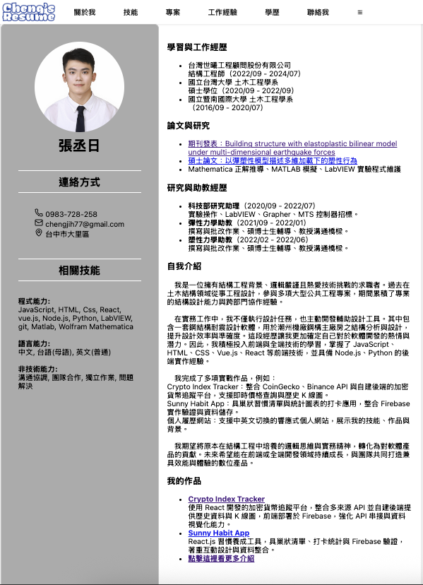

Cheng's Resume Website

**Description**: Personal bilingual resume site built with Vue 3 + Vite + Firebase  
**Website**: [https://chengs-resume.web.app](https://chengs-resume.web.app)  
**Topics**: vue3, resume, portfolio, i18n, vite

# Cheng's Resume Website

A bilingual (中文/English) responsive resume and portfolio site built with Vue 3.  
This project showcases frontend and backend projects, professional experience, education background, and allows PDF export of the current view (excluding the topbar).

## 🌐 Demo
👉 [Live Website](https://chengs-resume.web.app/)




## ✨ Features

- 🇨🇳🇺🇸 Bilingual support (English / 中文)
- 📱 Responsive layout for desktop and mobile
- 💼 Projects categorized into Frontend, Backend, and Personal
- 📄 One-click PDF export of the current page
- 🌙 Topbar with dynamic menus and overflow burger menu
- 🎨 Styled using custom CSS and icon support (Lucide icons)

## 🛠️ Built With

- [Vue 3 + Vite](https://vitejs.dev/)
- [Vue Router](https://router.vuejs.org/)
- [Vue I18n](https://vue-i18n.intlify.dev/)
- [html2pdf.js](https://github.com/eKoopmans/html2pdf) – for PDF export
- [Lucide Icons](https://lucide.dev/icons/)

## 📁 Project Structure
```
src/
├── assets/ # Static assets
├── components/ # Reusable components (Topbar, SubMenu, Popup, etc.)
├── data/ # Resume data in zh/en JSON format
├── topbar/ # Topbar + language/download popups
├── views/ # Page views (Home, Resume, Contact, Skills, etc.)
├── App.vue # Root component
├── main.js # App entry point
```

🚀 Quick Start

```bash
# Clone the repo
git clone https://github.com/LazyBear168/myResume.git
cd myResume

# Install dependencies
npm install

# Start the local server
npm run dev

